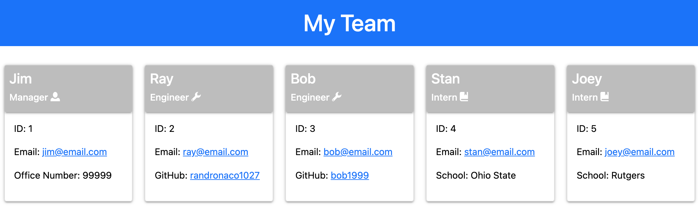

# Team Profile Generator

## User Story
AS A manager

I WANT to generate a webpage that displays my team's basic info

SO THAT I have quick access to their emails and GitHub profiles

## Description
From the command line, the user is prompted to enter the name, ID and email for the Manager as well as the office number. The user is then prompted to choose between adding an Engineer or an Intern to their team. Once the user fills out the information for this employee they are given the option to add another employee.

After all team members have been entered then an HTML is generated displaying the entire team and their relevant information.

## Installation
npm install inquirer

npm install --save-dev jest

## Walkthrough Guide
https://drive.google.com/file/d/16KWv7t4mcx55oAufy94QuTlbZdm9tWZD/view?usp=sharing 

## Preview of finished HTML

## Deployed Application URL
https://randronaco1027.github.io/team-profile-generator/ 